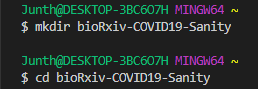
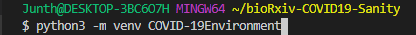
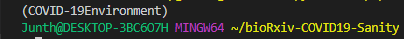
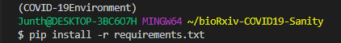
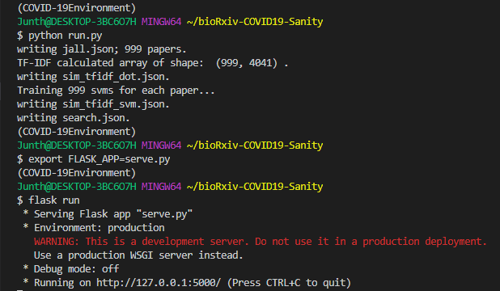

 
   <p align="center">
   <h1 align="center">bioRxiv medRxiv COVID19-Sanity</h1>
</p>

<p align="center">
  
</p>
<p align="center">
  <strong>Junth Basnet</strong>
</p>

---

This project organizes `COVID-19 SARS-CoV-2 preprints from medRxiv and bioRxiv`. This project makes data searchable, sortable, etc. The most similar search uses **Exemplar SVM** trained on `TF-IDF feature vectors` from the `abstract, title and author` of these papers.

<p align="center">
                                  
</p>
  
# Installation Dependencies  
```
Python 3.8.1
Flask 1.1.1
requests 2.23.0
numpy 1.18.2
sklearn
```

# How to Run (Development Server)?
**Step 1**
<p align="center">
</p>

**STEP 2 (Optional)**
<p align="center">
</p>

**STEP 3**
<p align="center">
</p>

**STEP 4**
<p align="center">
</p>

**STEP 5**
<p align="center">
</p>
